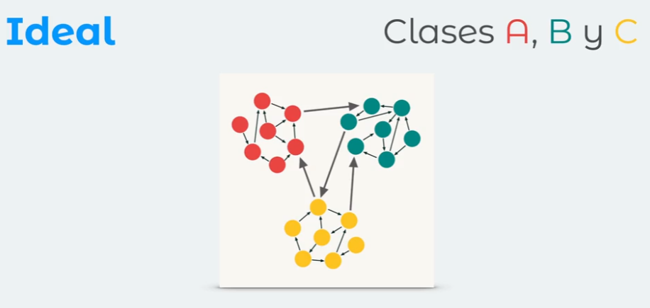

# Notas tomadas durante el curso

## Deuda técnica y Clean Code

La deuda técnica es la falta de calidad en el codigo que repercutirá en costos futuros.

La mala calidad en el software siempre la acaba pagando o asumiendo alguien, ya sea el cliente, el proovedor con recurso o el propio desarrollador dedicando tiempo a refactorizar o malgastando tiempo programando sobre un sistema frágil.

La deuda técnica muchas veces es inevitable y esta tiene costos monetarios por las siguientes razones:

- Tiempo en realizar matenimientos.
- Tiempo en refactorizar código.
- Tiempo en comprender el código.
- Tiempo adicional en capacitar a un tercero del código.

### Esquema de deuda técnica de Martin Fowler

- Imprudente y deliverada
Esto suele crear un proyecto poco robusto y poco tolerante al cambio. Suele suceder en proyectos donde el plazo de entrega es muy corto.
- Imprudente e inadvertida
Esta es el tipo de deuda más peligrosa y suele suceder en los desarrolladores juniors.
- Prudente y deliverada
Esto suele ser lo mas común, suele suceder en un proyecto donde el plazo de entrega es muy corto pero se suelen dejar cosas pendientes a refactorizar en un futuro.
- Prudente e inadvertida
Es el momento durante el proyecto cuando te cae el 20 que la forma en la que implementaste las cosas realmente no fue la mejor y porque ya te llego la deuda tecnica y empiezas a barajar opciones para refactorizar tu código o seguir adelante así.

Caer en la deuda técnica es normal y en muchos casos inevitable pero lo que hace a un buen programador es buscar la forma de pagarla.

### Refactorización

Es el proceso el cual tiene como objetivo mejorar el código sin alterar su comportamiento para que este sea mas entendible y tolerante a cambios basicamente la forma de pagar la forma de pagar la deuda técnica.

Para realizar una refactorización fuerte y que esta no falle, es necesario contar con pruebas automaticas para asegurarnos que no hayan resultados inesperados.

Cuando no se hacen pruebas automaticas se suele incurrir en el famoso **"Si funciona, no lo toques"** lo cual es producto de no tener un código fuerte y tolerante a cambios.

### Clean code

Clean code es aquel que se ha escrito con la intención de que otra persona o tu mismo lo entienda en el futuro, este debería ser simple y directo, deberia poder leerse con la misma facilidad que un texto bien escrito.

### Consideraciones para funciones

- Deben ser simples
- Su tamaño debe ser reducido
- Menos de 20 lineas
- Evitar el uso del "else"
- Priorizar el uso de la condicional ternaria
- Evitar anidaciones innecesarias

### Principio DRY

- Don't Repeat Yourself
- Simplemente evitar tener código duplicado
- Simplifica las pruebas
- Ayuda las pruebas
- Aplicar el principio DRY, suele llevar a refactorizar

## Clean Code y Clases

Las clases deben de tener una responsabilidad especifica ya que al ser muy generica va a ser dificil de mantener (probar, expandir).

Es importante tener presente que así como todo, hay excepciones a cada regla, pero esto debería ser un caso aislado y no el estándar. Tratemos de escribir un mejor código y dejar de lado la comodidad de hacer las cosas como se han venido haciendo, especialmente si esas cosas traen muchos problemas.

## Estructura recomendada de una clase

### Propiedades

Comenzar con la lista de propiedades y respetar las convenciones del lenguaje o framework con el que trabajas.

1. Propiedades estáticas
2. Propiedades públicas de último

### Métodos

1. Se empieza por los constructores estáticos si existen
2. El constructor
3. Los métodos estáticos
4. Métodos privados después
5. Resto de métodos de instancia ordenados de mayor a menor importancia
6. Y por ultimo los getter y setters

## Code smells y Acronimo STUPID

1. S - Singleton: patrón singleton
2. T - Tight Coupling: alto acoplamiento
3. U - Unestability: código no testeado
4. P - Premature optimization: optimizaciones prematuras
5. I - Indescriptive Naming: nombres poco descriptivos
6. D - Duplication: Duplicidad de código, no aplicar el principio DRY.

### Patrón Singleton

Pros:

- Garantiza una única instancia de la clase a lo largo de toda la aplicación.

Cons:

- Vive en el contexto global.
- Puede ser modificado por cualquiera en cualquier momento.
- No es rastreable.
- Dificil de testear debido a su ubicacion.

### Alto acoplamiento

Lo ideal seria manejar un bajo acoplamiento y una buena cohesión.

Desventajas del alto acoplamiento

- Un cambio en un módulo genera un efecto dominó de los cambios en otros módulos.
- El ensamblaje de módulos puede requerir más esfuerzo y tiempo debido a la dependencia entre módulos.
- Un módulo en particular puede ser mas difícil de reutilizar y probar porque se deben incluir los módulos dependientes.

Posibles soluciones:

- **A** tiene un atributo que se refiere a **B**
- **A** llama a los servicios de un objeto **B**
- **A** tiene un método que hace referencia a **B** (a través del tipo de retorno o parámetro)
- **A** es una subclase o implementa la clase **B**

### Cohesión

La cohesión se refiere a lo que la clase o módulo puede hacer.

- Una baja cohesión significaria que la clase realiza una gran variedad de acciones; es amplia no se enfoca en lo que debe hacer.
- Lo ideal una alta cohesión significa que la clase se enfoca en lo que deberia estar haciendo, es decir solo métodos relacionados con la intención de la clase.

### Acomplamiento

Se refiere a cuán relacionadas o dependientes son dos clases o módulos entre sí.

- En bajo acoplamiento, cambiar algo importante en una clase no deberia afectar a la otra.
- En alto acomplamiento, dificultaría el cambio y el mantenimiento de su código; dado que las clases están muy unidas, hacer un cambio podría requeriar una renovación completa del sistema.

### Optimizaciones prematuras

Mantener abiertas las opciones retrasando la toma de decisiones nos permite darle mayor relevancia a lo que es más importante en una aplicación.

### Complejidad esencial

La complejidad es inherente al problema.

### Complejidad accidental

Cuando implementamos una solución compleja a la mínima indispensable.

### Nombres poco descriptivos

- Nombres de variables mal nombradas
- Nombre de clases genéricas
- Nombres de funciones mal nombradas
- Ser muy especifico o muy generico

### Duplicidad de código

No aplicar el principio DRY.

#### **Real**

- Código es idéntico y cumple la misma función.
- Un cambio implicaría actualizar todo el código idéntico en varios lugares.
- Incrementa posibilidades de error humano al olvidar una parte para actualizar.
- Mayor cantidad de pruebas innecesarias.
- Si notas que estas copiando código es probable que podrias refactorizar para no caer en DRY.

#### **Accidental**

- Código luce similar pero cumple con funciones distintas
- Cuando hay un cambio solo hay que modificar un solo lugar.
- Este tipo de duplicidad se puede trabajar con parametros u optimizaciones.

### Inflación

- Metodos enormes: con muchas lineas que se hacen dificiles de mantener; en estos casos se recomienda refactorizar en funciones mas pequeñas y entendibles.
- Clases grandes: al igual que en el caso de los métodos se deben separar en pequeños submodulos para reducir la duplicidad de código, favorecer la reutilización y que las clases tengan un proposito único.
- Obsesión primitiva: La obsesión primitiva ocurre cuando se utilizan tipos de datos primitivos (como strings, números, booleanos) para representar conceptos importantes del dominio, en lugar de crear tipos o clases específicas para ellos.

**Problemas que genera:**

- Dificulta la validación y el control de los datos.
- Hace el código menos expresivo y más propenso a errores.
- Complica el mantenimiento y la evolución del sistema.

### Acopladores

- Feature Envy: Cuando un metodo o funcion hace mucha referencia a una funcion de otro modulo tal vez la refactorizacion no fue buena (sinceramente no me quedó del todo clara)
- Intimidad inapropiada: Cuando una clase usa campos y metodos internos de otra clase, las buenas clases deben saber lo menos de las clases con las que interactua.
- Cadenas de mensajes: Es cuando una función **A** llama una función **B** y esta a una función **C** y esta misma a una función **D**
- The middle man es cuando una función solo existe para pasarle los parametros a otra función, significa que no deberia de existir.
